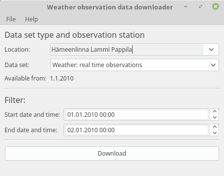



## About
[Finnish Meteorological Institute opened its obervation data to free use in 2013](https://ilmatieteenlaitos.fi/avoin-data). The open data service
is however designed for software developers and is almost impossible to use for other people. 
Since not all enthusiasts and researchers have programming skills to use the service themselves, there was a need for simple utility-application to download the weather data into Excel format.

This downloadable application was originally developed by request of [Lammi Biological Station](http://www.helsinki.fi/lammi/). 

## Supported features
At the moment the application supports 

* Downloading daily weather observations from single weather stations
* Downloading realtime weather observations from single weather stations
* English and Finnish user-interface

## Download
Check the [Downloads page](downloads.html).
Please check the [Quickstart page](quickstart/quickstart.html) before usage! It has important info of setting up process.

## I have a feature request or bug report
You can submit feature and bugfix requests via Github project page by [creating a new issue](https://github.com/Tumetsu/Ilmatieteenlaitoksen-saadata-lataaja/issues). You most likely have to be registered into Github first. After that, press "New issue" button on top right on the page and write a description of the issue. Finally select proper "Label" for the issue from Labels menu from left and click "Submit new issue".

## Weatherdata license
The data downloaded by this program is directly from FMI's server. User should follow the [license of the data described in FMI's service](http://ilmatieteenlaitos.fi/avoin-data-lisenssi). When using the data in your work, research etc. it is your responsibility to follow the guidelines and licenses of the FMI.

##Opensource
The application is released as a opensource under GPL-license. To find all the sourcecode, please visit project's [Github page.](https://github.com/Tumetsu/Ilmatieteenlaitoksen-saadata-lataaja)
Project page also contains additional info about the development.

