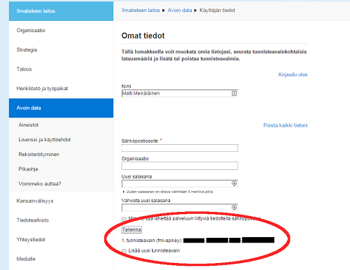
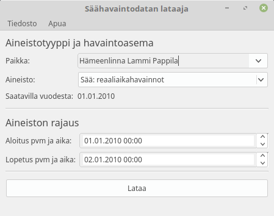



## What is this downloader?
Finnish Meteorological Institute (FMI) provides open weather data service. This data is provided in machine readable format and is thus only usable for software developers. With this application it is however possible to get this data and save it into format which is compatible with regular spreadsheet programs, such as Excel without programming knowledge.

## Initial setup
After isntalling the application, before using it you have to register into FMI's open data service:

 1. Open the following page on your browser: https://ilmatieteenlaitos.fi/avoin-data
 2. On the page there is a way to register an account and log in. Below is a picture of the page on 2.3.2015. Follow the instructions on the page and create an account. 

 3. Log in to your new user account. You should see ”Omat tiedot” page. On the bottom of the page should be ”tunnisteavain (fmi-apikey)” check picture below. Copy (Ctrl+C) the API-key to your clipboard. 

 4. Now open the FMIDownloader and go to File > Set API-key You should see a dialog like in picture below. Paste the API-key into text-field and click OK. 

 5. FMIDownloader is now ready to use!

----------

## Downloading observation data
The FMIDownloader provides a way to download observation data from various Finnish weather stations. Resulting data depends on the sensors of the station. Application always downloads all available sensor data from station.

1. Select the weather station of your choice from the dropdown menu or write the initial letters of the station to the field and select the right one from suggestions. 
2. Select data set to download from drop down menu.
3. After selecting the station you can see the starting year where data is available from this station. For example in the picture below the Lammi's station has data from 1963.

	> ATTENTION! The Available from year **doesn't** mean that there is data available from beginning of the year. In this case if you search data from beginning of the year (e.g. 1.1.1963 - 1.2.1963) the application will not find data and will display an error message. In this case you can edit your start and end dates towards the end of the year until you can find some data (e.g. esim. 1.1.1963 – 1.1.1964)

4. Set dates you want to the start and end date fields. Note that the dates are not allowed to be same and the end date is not allowed to predate the start date. 
5.   Press the "Download" button.
6. After download has finished you can select the location to save the resulting csv-file. Wait a moment for program to save the file.

## Troubleshooting
Occasionally something might go wrong and the application shows an error message. It is important to read these messages since they usually give you advice on how to proceed. Below are descriptions of the most common error messages you might ecnounter.

### Software won't start
**Reason:**
Most common reason is limited user privileges. If you are using a work place machine, you might have restricted privileges to install
and run software. In this case please ask your system administrator to install FMIDownloader to your computer or use it instead on your
own computer.

### Data request failed 
**Reason:** 

> Most likely the API-key is not set or it is invalid

**Solution:**  

> Follow the Initial Setup in this guide to set up the API-key properly.

### Specified date and time could not be found.
**Reason:**  

> Most likely FMI's service don't have data fro the time span you defined. In case you retrieved data from the first year of the available time range of the station, it is likely that there is not data available from beginning of the year. Follow instructions above about downloading data. 

**Solution:**  

> Check Downloading the daily or real time instructions on this guide. Especially the ATTENTION part.

### Weather station was not found.
**Reason:**  

> FMI's service doesn't have information for this station. There might be a temporary problem in the service or it might have a specific problem with the station you were trying to access. Finally it is always possible that this program has been out-dated and the FMI's service as changed drastically and is incompatible with this application.

**Solution:**  

> If the error happens only for certain stations, the problem is likely temporary or is station specific. In this case you should wait some time and try again or ask the data directly from FMI. If the error happens on every station on the list, you will likely have to update the FMIDownloader. Check if there is new releases on Downloads page.

### Unknown error
**Reason:**  

> Most likely there is a bug in the software

**Solution:**  

> You can try to ignore the problem and just restart the application. In case the error repeats itself, you should contact me by leaving an issue on the Github. You can submit feature and bugfix requests via Github project page by [creating a new issue](https://github.com/Tumetsu/FMI-weather-downloader/issues). You most likely have to be registered into Github first. After that, press "New issue" button on top right on the page and write a description of the issue. Finally select proper "Label" for the issue from Labels menu from left and click "Submit new issue".

