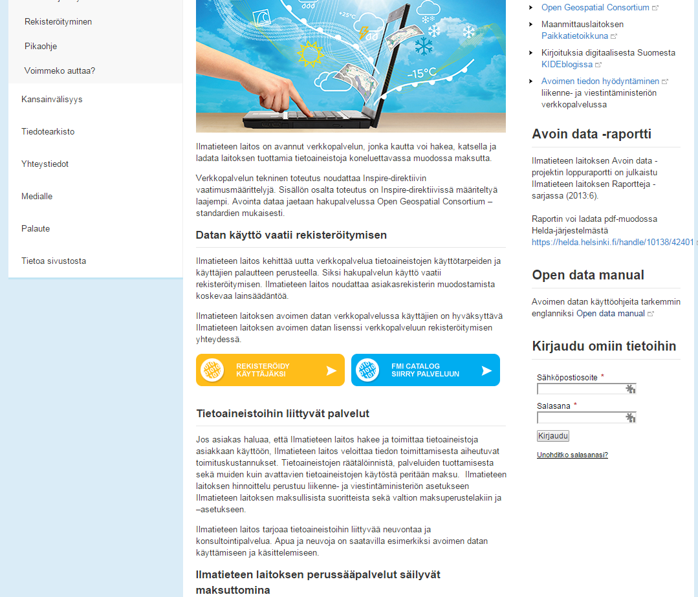
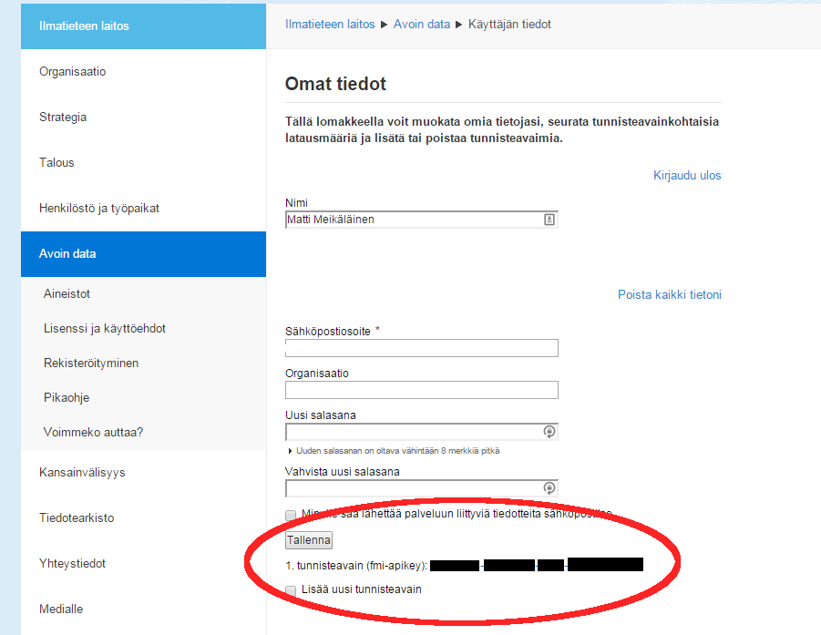
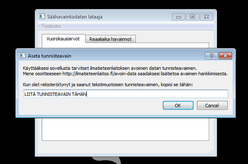
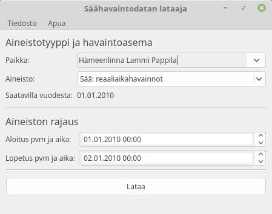



##Mikä on säädata-lataaja?
Suomen Ilmatieteenlaitos tarjoaa säähavaintodataa eri Suomen asemiltaan ilmaiseksi verkossa. Kyseinen avoin data on saatavilla koneluettavassa muodossa, ja siten käyttökelpoista lähinnä ohjelmistokehittäjille. Tämän työkalun avulla Ilmatieteenlaitoksen säähavaintodataa voi kuitenkin ladata ja tallentaa yleisten taulukkolaskentaohjelmien ymmärtämään muotoon ilman ohjelmistokehittäjäosaamista.

##Ohjelman käyttöönotto
Asennettuasi ohjelman, ennen sen käyttöönottoa sinun tarvitsee rekisteröityä Ilmatieteenlaitoksen avoimen datan palveluun:

 1. Avaa seuraava verkko-osoite internetselaimeesi: https://ilmatieteenlaitos.fi/avoin-data
 2. Ilmatieteenlaitoksen sivuilla pitäisi olla tarjottuna keino rekisteröityä palveluun. Kuvassa on kuva sivustosta 2.3.2015. Noudata sivun ohjeita ja luo itsellesi tunnus palveluun. 
    

 3. Kirjaudu sisään käyttäjätilillesi Ilmatieteenlaitoksen palvelussa. Kirjauduttuasi palvelussa pitäisi näkyä ”Omat tiedot” sivu, jonka alareunassa on kohta ”tunnisteavain (fmi-apikey)” kts. Kuva 2. Kopioi (Ctrl+C) tunnisteavain. 
    

 4. Avaa nyt latausohjelma ja valitse Tiedosto > Aseta tunnisteavain kts. Kuva 3. Avautuneessa ikkunassa liitä kopioimasi tunnisteavain annettuun tekstikenttään ja klikkaa OK. 
    

 5. Ohjelma on nyt valmis käytettäväksi.

----------

##Vuorokausi säähavaintojen lataaminen
Sovellus tarjoaa mahdollisuuden ladata Ilmatieteenlaitoksen sääasemien mittaamia vuorokausikohtaisia 
tietoja. Asemasta riippuen dataa on saatavilla pitkiltäkin aikaväleiltä. 

1.  Valitse ”Vuorokausiarvot” välilehti. 
2.  Valitse sääasema pudotusvalikosta tai kirjoita aseman nimen alku kenttään ja valitse löytynyt asema   listasta. 
3.  Aseman valinnan jälkeen ohjelma kertoo miltä vuodelta dataa on asemalta saatavilla.  Kuvan 4. esimerkissä Lammin Biologisen aseman säädataa on saatavilla vuodesta 1963. 

	> HUOM! Joillakin asemilla dataa on saatavilla vain ”keskeltä” ilmoitettua 
	vuotta. Tällöin mikäli etsit dataa alkuvuodesta (esim. 1.1.1963 – 
	1.2.1963) ohjelma ei luonnollisesti löydä dataa ja antaa 
	virheilmoituksen.  
	Tällöin kannattaa lopetus- ja aloitusaikoja säätää loppuvuotta kohti 
	kunnes dataa alkaa löytymään (esim. 1.1.1963 – 1.1.1964). 

4.   Aseta Aloitus- ja lopetuspäivämäärä kenttiin haluamasi päivämäärät, joiden väliltä haluat hakea 
tietoa. Huomaa että päivämäärät eivät voi olla samoja ja lopetuspäivämäärän on tultava 
aloituspäivämäärän jälkeen.
5.   Paina ”Lataa” painiketta. 
6. Latauksen valmistuttua aukeavassa ikkunassa voit valita paikan johon tiedosto tallennetaan. 

----------

##Reaaliaikaisten säähavaintojen lataaminen 
Sovellus tarjoaa mahdollisuuden ladata Ilmatieteenlaitoksen sääasemien mittaamia reaaliaikaisia 
säähavaintoja. Tällöin kyseessä on yleensä 10 minuutin välein mitattua dataa. Aseman mittareista riippuen 
saatavilla on eri määrä erilaisia suureita.  

 1. Valitse ”Reaaliaika havainnot” välilehti. 
 2. Valitse sääasema pudotusvalikosta tai kirjoita aseman nimen alku kenttään ja valitse löytynyt 
asema listasta.
 3.  Aseman valinnan jälkeen ohjelma kertoo miltä vuodelta dataa on asemalta saatavilla. Kuvan 5. 
esimerkissä Lammin Biologisen aseman säädataa on saatavilla vuodesta 2010.  

> HUOM! Joillakin asemilla dataa on saatavilla vain ”keskeltä” ilmoitettua 
> vuotta. Tällöin mikäli etsit dataa alkuvuodesta (esim. 1.1.1963 – 
> 1.2.1963) ohjelma ei luonnollisesti löydä dataa ja antaa 
> virheilmoituksen.  
> Tällöin kannattaa lopetus- ja aloitusaikoja säätää loppuvuotta kohti 
> kunnes dataa alkaa löytymään (esim. 1.1.1963 – 1.1.1964). 

 4.  Aseta Aloitus- ja lopetuspäivämäärä ja kellonaikakenttiin haluamasi päivämäärät, joiden väliltä 
haluat hakea tietoa. Huomaa että päivämäärät eivät voi olla samoja ja lopetuspäivämäärän on 
tultava aloituspäivämäärän jälkeen. 
 5.  Paina ”Lataa” painiketta. 
 6. Latauksen valmistuttua aukeavassa ikkunassa voit valita paikan johon tiedosto tallennetaan. 

----------

##Virhetilanteet
Ajoittain jokin saattaa mennä pieleen ja ohjelma esittää virheilmoituksen ja yleensä neuvoja virheen 
ratkaisemiseksi. Alla kuvaukset yleisimmistä virhetilanteista. 

###Datapyyntö ei onnistunut 
**Syy:** 

> Todennäköisesti tunnisteavainta ei ole asetettu tai se on virheellinen
> (kopioitu väärin tms.)

**Ratkaisu:**  

> Noudata tämän oppaan käyttöönotto-ohjetta ja varmista, että
> tunnisteavain on oikein  asetettu.

###Määritettyä ajanjaksoa ei löytynyt 
**Syy:**  

> Ilmatieteenlaitoksen palvelussa ei ole olemassa dataa haluamallesi
> aikavälille. Mikäli hait  dataa aseman ensimmäiseltä mittausvuodelta,
> on todennäköistä, että varsinaista  mittausdataa ei ole saatavilla
> Tammikuun alusta alkaen.

**Ratkaisu:**  

> Mikäli haet vuorokausidataa, kokeile ensin pidentää aikaväli
> seuraavaan vuoteen saakka.  Esim. 1.1.1963 – 1.2.1964. Reaaliaikadataa
> etsittäessä voit kokeilla samaa sekä siirtämällä  aloitus päivämäärää
> kunnes dataa löytyy.

###Määritettyä sääasemaa ei löydetty 
**Syy:**  

> Ilmatieteenlaitoksen palvelusta ei jostain syystä löytynyt tietoja
> hakemallesi asemalle.  Palvelussa voi olla hetkellinen häiriö tai
> siinä on vikaa kyseisen aseman tietojen saannin  kanssa.
> Vaihtoehtoisesti Ilmatieteenlaitoksen palvelu on toiminnaltaan
> muuttunut, eikä tämä  ohjelma kykene enää hyödyntämään sitä.

**Ratkaisu:**  

> Mikäli virhe tapahtuu vain yksittäiselle asemalle, vika lienee
> ohimenevä tai koskee vain  tiettyä asemaa. Tällöin kannattanee
> tarvittavaa tietoa pyytää Ilmatieteenlaitokselta. Mikäli 
> virheilmoitus kuitenkin esiintyy jokaisen aseman kohdalla, täytyy
> sinun todennäköisesti  päivittää ohjelma.

###Tuntematon virhe 
**Syy:**  

> Todennäköisesti ohjelmakoodissa on jokin virhe.

**Ratkaisu:**  

> Voit kokeilla ohittaa virheen olankohautuksella ja käynnistää ohjelman
> uudelleen. Mikäli  sama virhe toistuu, lienee hyvä ottaa minuun
> yhteyttä (kts. ensimmäinen sivu) ja kertoa  minulle koko
> virheilmoituksen teksti sekä mielellään mitä teit juuri ennen virheen 
> sattumista. Näillä tiedoilla voin toivottavasti etsiä ja korjata
> virheen syyn ja päivittää  ohjelmiston. Virheraportin voi kirjoittaa osoitteessa https://github.com/Tumetsu/Ilmatieteenlaitoksen-saadata-lataaja/issues 
> Paina "New Issue" painiketta ja kirjoita mahdollisimman tarkka kuvaus ongelmasta. Valitse vasemmalta "Labels" valikosta sopiva labeli, esimerkiksi "Bug"
