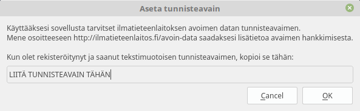



Ilmatieteenlaitoksen säädata-lataajan käyttöopas
=============

##Mikä on säädata-lataaja?
Suomen Ilmatieteenlaitos tarjoaa säähavaintodataa eri Suomen asemiltaan ilmaiseksi verkossa. Kyseinen avoin data on saatavilla koneluettavassa muodossa, ja siten käyttökelpoista lähinnä ohjelmistokehittäjille. Tämän työkalun avulla Ilmatieteenlaitoksen säähavaintodataa voi kuitenkin ladata ja tallentaa yleisten taulukkolaskentaohjelmien ymmärtämään muotoon ilman ohjelmistokehittäjäosaamista.

##Ohjelman käyttöönotto
Asennettuasi ohjelman, ennen sen käyttöönottoa sinun tarvitsee rekisteröityä Ilmatieteenlaitoksen avoimen datan palveluun:

 1. Avaa seuraava verkko-osoite internetselaimeesi: https://ilmatieteenlaitos.fi/avoin-data
 2. Ilmatieteenlaitoksen sivuilla pitäisi olla tarjottuna keino rekisteröityä palveluun. Kuvassa 1. on kuva sivustosta 2.3.2015. Noudata sivun ohjeita ja luo itsellesi tunnus palveluun. 
Kuva 1: Ilmatieteenlaitoksen avoimen datan palvelu
 3. Kirjaudu sisään käyttäjätilillesi Ilmatieteenlaitoksen palvelussa. Kirjauduttuasi palvelussa pitäisi näkyä ”Omat tiedot” sivu, jonka alareunassa on kohta ”tunnisteavain (fmi-apikey)” kts. Kuva 2. Kopioi (Ctrl+C) tunnisteavain. 
 4. Avaa nyt latausohjelma ja valitse Tiedosto > Aseta tunnisteavain kts. Kuva 3. Avautuneessa ikkunassa liitä kopioimasi tunnisteavain annettuun tekstikenttään ja klikkaa OK. 
 5. Ohjelma on nyt valmis käytettäväksi.

----------

